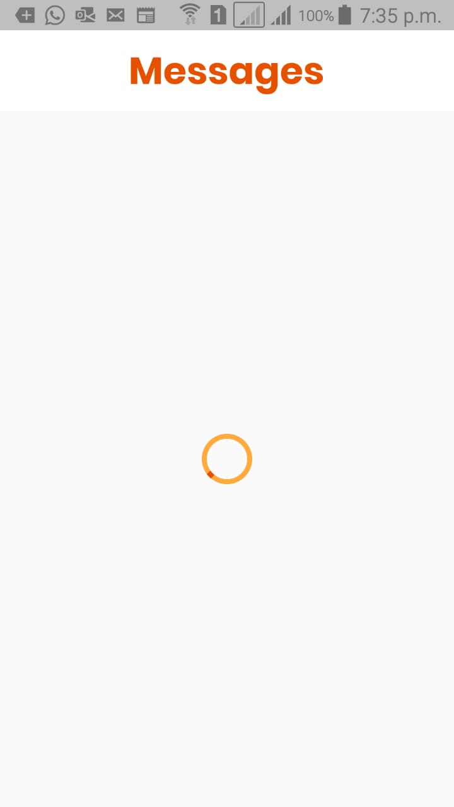
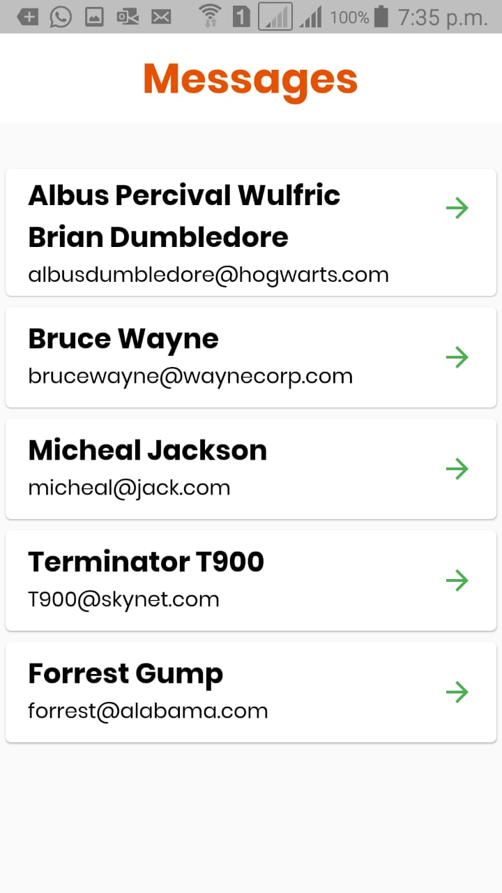
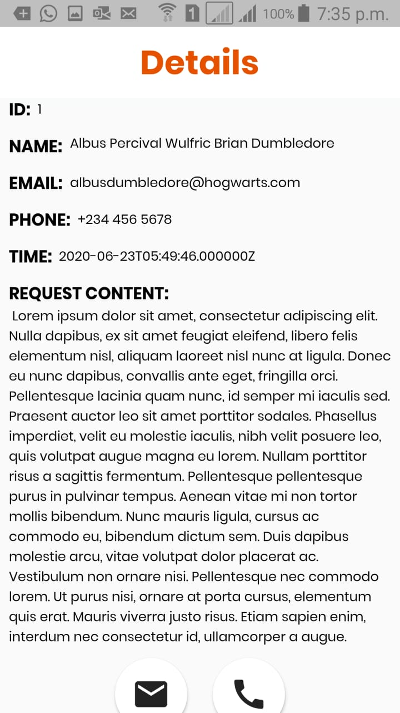
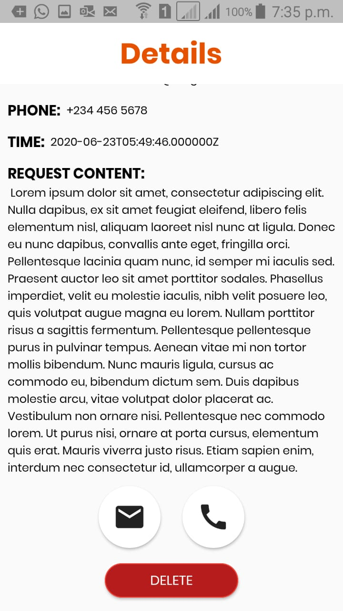

# Flutter Test | Pie Solutions

A simple mobile application using Flutter that fetches random data using a REST API and stores it in its local storage for any local manipulations.

# Screenshots

## Splash Screen

## LoadingBar

## Home Screen with Data

## Home Screen without Data

## Details Pages

## Getting Started

This project is a starting point for a Flutter application.

A few resources to get you started if this is your first Flutter project:

- [Lab: Write your first Flutter app](https://flutter.dev/docs/get-started/codelab)
- [Cookbook: Useful Flutter samples](https://flutter.dev/docs/cookbook)

For help getting started with Flutter, view our
[online documentation](https://flutter.dev/docs), which offers tutorials,
samples, guidance on mobile development, and a full API reference.
